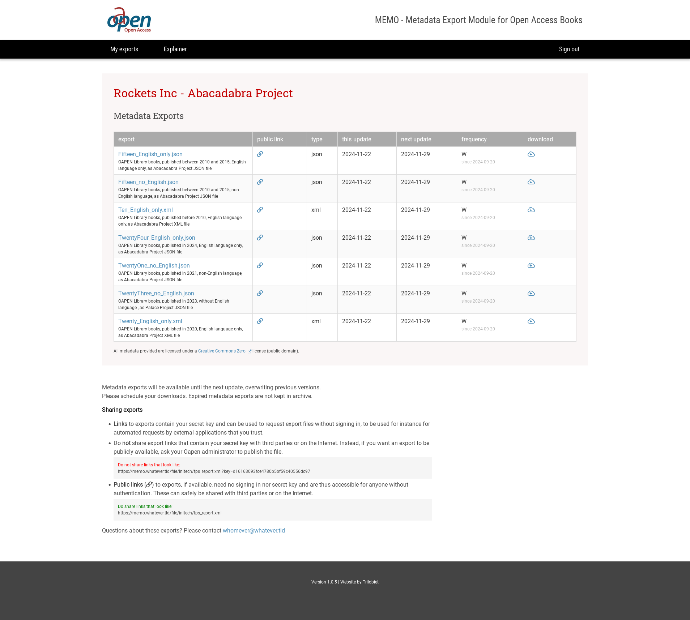

# Oapen MEMO Client Web

The MEMO Client Web is a web site that serves exported files, generated by MEMO Task Runner, from the client directories.

MEMO clients (customers) can download these files. The client web is a restricted area. 
You need a user account to access the site. Clients can only view their own data.

## Configuration

* `server.port`
   Choose a free port (e.g. 8083) to map your external web server (NGINX) to.
* `spring.datasource.url`
   Database url (`jdbc:mysql://12.34.56.123:3306/oapen_memo?reconnect=true&rewriteBatchedStatements=true`)
* `spring.datasource.username`
* `spring.datasource.password`
   Login credentials 
* `application.filesroot`
   Root directory for the generated export files (`${user.home}/oapenmemo/exports/`). OAPEN Task Runner writes its output here.
   See below (Files root directory) for a detailed explanation. 

### Files root directory

The directory at `application.filesroot` has a sub-directory for each client containing the files generated by the task runner.

	exports
	  |-- abc_corp
	  |-- a_client
	  |-- another_client
	  .
	  .
	  |-- tmp
	  .
	  .
	  |-- zzz_corp
	  
These directories contain the latest version of exported data for each task for the associated client, 
given the current date is after the task's `startDate` value. (`tmp` is a special directory for internal use, not associated with any client.)

Given a client 'abc_corp' and a task 'some_fancy_task' of type `xml` the associated file will be located at `exports/abc_corp/some_fancy_task.xml`.

## Installation and running

This application must be installed as a service.

- Copy `clientweb-x.y.z.jar` to the user's (`oapen`) home directory;
- Create a symlink `ln -s clientweb-x.y.z.jar clientweb.jar`;
- In `/etc/systemd/system` create a file named `oapen-memo-clientweb.service` with the content
  copied from [Readme-memowebsite-service.txt](./Readme-memowebsite-service.txt).  
- Create a mapping on your webserver to access the application from the internet (NGINX example below):
        
     server {
         
         server_name memo.oapen.org;
         
         location / {
             proxy_set_header Host $host;
             proxy_set_header x-forwarded-for $remote_addr;
             proxy_pass http://localhost:8083;
         }
     }
    
- Run `certbot` (https://certbot.eff.org/) or use an equivalent tool to obtain an SSL Certificate and enforce secure connections.

## Usage        

After signing in, a single page is shown listing the most recent versions of all Task exports for which the `startDate` has passed. 
Click on the links to view or download the files.

As soon as the Task Manager generates a new report it will be listed here, overwriting any previous version.

When a chain icon 🔗 appears in the 'public link' column, the associated link is intended for public use and can be copied safely to other pages on the Internet.

